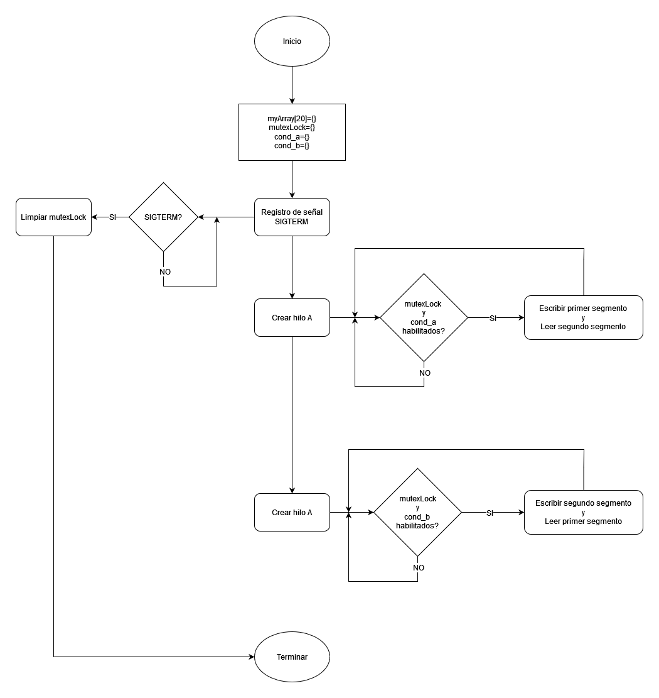

# Entregable práctica 3

## Interpretación del problema
Es similar al problema de la práctica 2. A excepción de que se emplean hilos, y acá aparece mi primera duda en cómo interpretar el problema, porque pide que se haga con hilo y recursos compartidos (asumo que como los hilos pueden compartir los recursos del padre esa es la forma en que se debe encarar el problema), pero también pide que el programa se ejecute con argumentos 'programa a' y 'programa b', lo que implica que se ejecuten dos procesos diferentes, por lo que se podrían compartir recursos (fácilmente) entre los hilos, que es un poco la idea de usar hilos. Entonces mi interpretación es ignorar esta última parte y hacer un sólo programa que haga todo

## diagrama de flujo del algoritmo implementado
