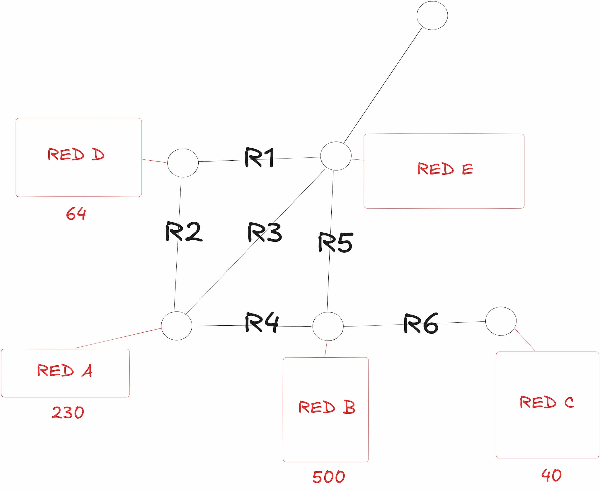
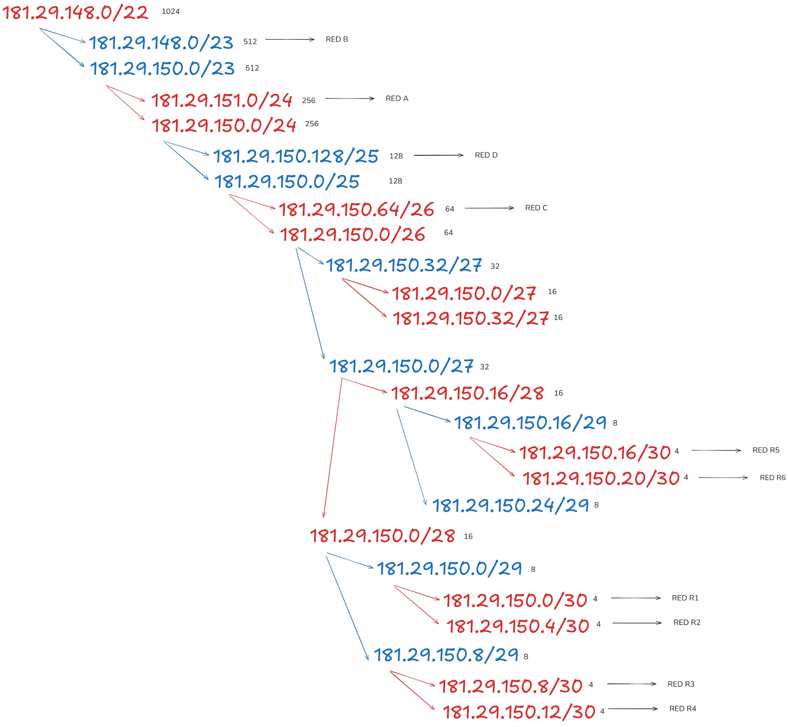
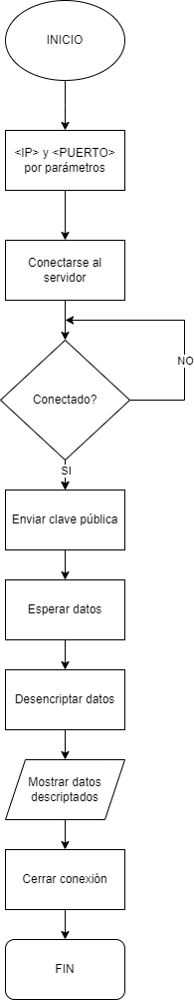
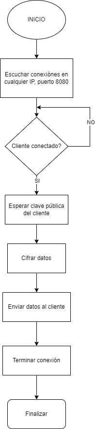

# Entregable práctica 4

## Redes

Se requiere hacer subnetting de la IP 181.29.148.0/22 para cumplir con los diferentes requerimientos.

## Interpretación de los problemas dados

### Cliente TCP

Se requiere que se haga un cliente capaz de recibir una secuencia de 26 enteros encriptados, los cuales deben ser desencriptados y presentados en pantalla (por la _salida estándard_). Esta debe hacerse mediante el uso de librerías estándares, además tiene que se capaz de recibir por argumentos la *IP* y el *puerto* al que se tiene que conectar.

### Servidor TCP

Se requiere un servidor capaz de enviar números de 0 al 26 encriptados (mediante una clave pública provista por el cliente que se conecta, este la envía). También se debe programar con librerías estándares.

## Diagrama de flujo de los algoritmos implementados

### Client

### Server

